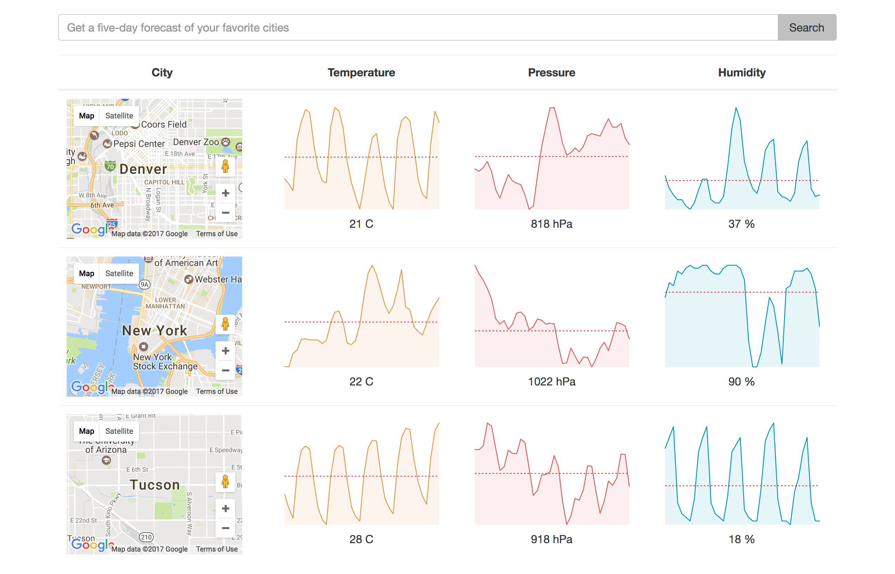

# Weather App with Redux

* Simple weather app (with openweather api) that lets you search the 5 day forecast by city.

* Displays the map of the city and sparkline charts of temp, pressure, and humidity history.

The app is based on Stephen Grider tutorial

# Screenshots

